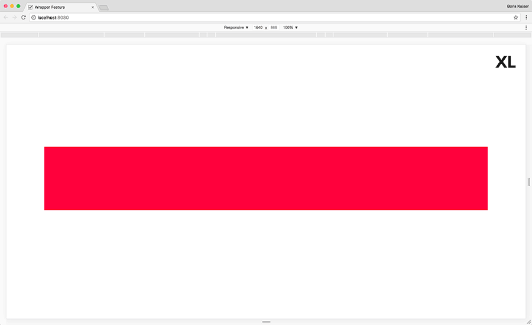
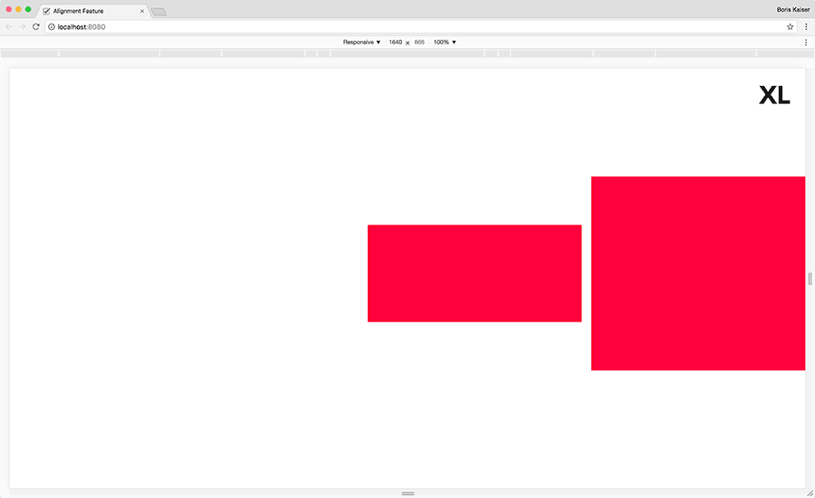
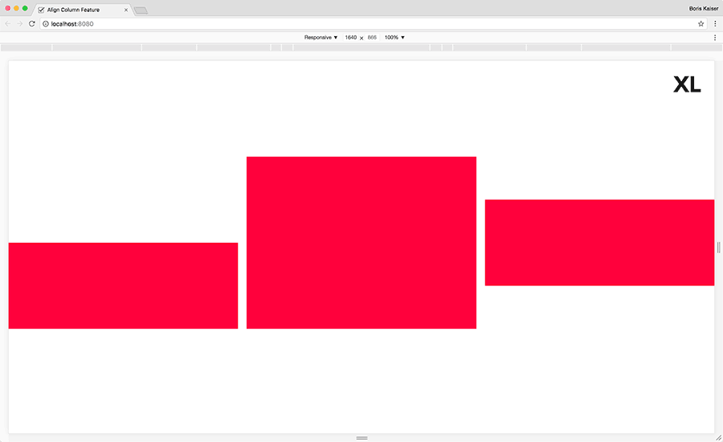

# sR Grid
> Dead Simple Flexbox Grid

[](https://david-dm.org/superReal/srgrid)
[](https://david-dm.org/superreal/srgrid?type=dev)
[](https://codeclimate.com/github/superReal/srgrid)
[](https://travis-ci.org/superReal/srgrid)
[](https://snyk.io/test/github/superReal/srgrid)

sR Grid is a flexible and fully responsive grid system based on [Flexbox](https://www.w3.org/TR/css-flexbox-1/).
It follows the mobile first approach and the features are module-based. In the default setup each feature is disabled 
and can be enabled as required. In this way the generated code remains as small as possible.

The sR Grid uses data attributes. The markup remains clear and easy to understand.

**Note that the README on the `master` branch might not match the one in the [latest stable release](https://github.com/superReal/srgrid/releases/latest)!**


## Contents
- [Installation](#installation)
- [Usage](#usage)
- [Modes](#modes)
- [Settings](#settings)
- [Features](#features)
- [Advanced](#advanced)
- [Helper mixins](#helper-mixins)
- [Helper functions](#helper-functions)


## Installation
    
```bash
$ yarn add @superreal/srbreakpoints @superreal/srgrid
```

If you prefer using npm:

```bash
$ npm install --save @superreal/srbreakpoints @superreal/srgrid
```

*Note: the sR Grid module uses [sR Breakpoints](https://github.com/superreal/srbreakpoints) as a dependency.*


## Usage

1. Import the sR Breakpoints & sR Grid modules
2. [Init sR Breakpoints](https://github.com/superreal/srbreakpoints#usage) module
3. Create a sR Grid grid

```scss
@import 'path_to_node_modules_folder/srbreakpoints/src/styles/srbreakpoints.scss';
@import 'path_to_node_modules_folder/srgrid/src/styles/srgrid.scss';

@include srbreakpoints-init(
    // Your sR Breakpoints settings
);
@include srgrid-create-grid(
    // Your sR Grid settings
);
```

*Note: on initialization the sR Grid module creates a global variable named `srgrid` {Map} including  all settings. For
further information see [Globals](#globals).*


## Modes

All features except the wrapper feature offer four different modes which can be activated when creating a grid.


*Note: all features except the hide feature can be used exclusively in `responsive` mode. The `regular`, `between` and
`only` modes were created to make the markup more readable.*


### 1. Regular

The feature settings always apply.

**Example markup**


*The `div` element will always be ten columns wide.*

```html
<div data-srgrid-col="10"></div>
```


### 2. Responsive

The feature settings are following an upward inheritance from each specific breakpoint (mobile first approach).

**Example markup**


*The `div` element will be ten columns wide from breakpoint "m" upwards. Within the default setting this width applies
to the breakpoints "m", "l" and "xl".*

```html
<div data-srgrid-col="m-10">...</div>
```


### 3. Between

The feature settings apply between two specific breakpoints.

**Example markup**


*The `div` element will be ten columns wide between the breakpoints "xs" and "m". Within default setting this width
applies to the breakpoints "xs", "s" and "m".*

```html
<div data-srgrid-col="xs-m-10">...</div>
```


### 4. Only

The feature settings only apply to a specific breakpoint.

**Example markup**


*The `div` element will be ten columns wide in breakpoint "m" only.*

```html
<div data-srgrid-col="m-only-10">...</div>
```


## Settings


### Grid id

sR Grid is able to create multiple grids. Each grid needs an unique grid id.

| Name | Description | Type | Default value |
|:-:|:-:|:-:|:-:|
| `$grid-id` | Grid id | String | `'srgrid'` |

*Note: in the default settings the `$grid-id` is used when creating the element attributes. If the`$grid-id` is changed
this is reflected in the naming of attributes.*


### Grid attribute names

sR Grid uses data attributes rather than classes for a simple markup syntax. These can be configured using the
following variables:

| Name | Description | Type | Default value |
|:-:|:-:|:-:|:-:|
| `$grid-attr-name` | Attribute name for the grid | String | `'data-#{$grid-id}'` |
| `$row-attr-name` | Attribute name for the row | String | `'data-#{$grid-id}-row'` | 
| `$column-attr-name` | Attribute name for the column | String | `'data-#{$grid-id}-col'` |


### Only attribute addition

The `only` mode needs an attribute addition which is used in the attribute value.

| Name | Description | Type | Default value |
|:-:|:-:|:-:|:-:|
| `$only-attr-addition` | Only attribute addition | String | `'only'` |

**Example markup**

```html
<div data-srgrid-col="m-only-2">...</div>
```


### Grid metrics

With sR Grid you are able to determine gutter widths as well as the amount of columns.

| Name | Description | Type | Default value |
|:-:|:-:|:-:|:-:|
| `$gutter-widths` | Gutter widths | Map | `(xs: 5, s: 5, m: 10, l: 15, xl: 20)` |
| `$column-count` | Column count | Number | `36` |

*In its default state sR Grid uses 36 columns. This makes it possible to create fully responsive pages within the span
of the whole viewport. A page can be centered by integrating columns on the left side for spacing.*

**Example markup for a centered fully responsive page**

```html
<div data-srgrid>
    <div data-srgrid-row>
        <div data-srgrid-col="6"></div> <!-- left spacing -->
        <div data-srgrid-col="24">
            Page content
        </div>
    </div>
</div>
```

For a cleaner code the [Offset feature](#offset-feature) can be used instead:

```html
<div data-srgrid>
    <div data-srgrid-row>
        <div data-srgrid-col="24 offset-6">
            Page content
        </div>
    </div>
</div>
```


## Features

sR Grid has twelve features that can be activated as needed.
Each feature except the wrapper feature has [four different modes](#modes).


### Wrapper Feature

The wrapper feature is used for centering areas with a maximum width.

**Settings**

| Name | Description | Type | Default value |
|:-:|:-:|:-:|:-:|
| `$wrapper-feature` | Enable the wrapper feature | Boolean | `false` |
| `$wrapper-attr-name` | Attribute name for the wrapper | String | `'data-#($grid-id)-wrapper'` |
| `$wrapper-max-widths` | Maximum widths for the wrapper | Map | `(xl: 1200)` |

*Note: the maximum width can also be determined for specific breakpoints.*

**Example implementation**



*The element with the wrapper attribute will have a maximum width of 400 px in breakpoint "xs"
and 1400 px in breakpoint "xl".*

```sass
@include srgrid-create-grid(
    $wrapper-feature: true,
    $wrapper-max-widths: (xs: 400, xl: 1400)
);
```

```html
<div data-srgrid>
    <div data-srgrid-wrapper> <!-- wrapper element -->
        <div data-srgrid-row>
            <div data-srgrid-col>
                ...
            </div>
        </div>
    </div>
</div>
```


### Hide Feature

The hide feature is used to hide an element on the page.

**Settings**

| Name | Description | Type | Default value |
|:-:|:-:|:-:|:-:|
| `$hide-feature` | Hide feature modes | Null/List | `null` |
| `$hide-attr-name` | Hide attribute name | String | `'data-#($grid-id)-hide'` |

*Note: the hide attribute can be set on all page elements.*

**Example implementation**


*The hide element is hidden between breakpoints "m" and "l".*

```sass
@include srgrid-create-grid(
    $hide-feature: between
);
```

```html
<div data-srgrid>
    <div data-srgrid-row>
        <div data-srgrid-col data-srgrid-hide="m-l"> <!-- hide element -->
            ...
        </div>
    </div>
</div>
```


### Fluid Feature

The fluid feature is used for a better control of the columns.

**Settings**

| Name | Description | Type | Default value |
|:-:|:-:|:-:|:-:|
| `$fluid-feature` | Fluid feature modes | Null/List | `null` |

**Example implementation**


*The fluid element will be 20 columns wide in breakpoint "l" and 10 columns wide in all other breakpoints.*

```sass
@include srgrid-create-grid(
    $fluid-feature: regular only
);
```

```html
<div data-srgrid>
    <div data-srgrid-row>
        <div data-srgrid-col="10 l-only-20"> <!-- fluid element -->
            ...
        </div>
    </div>
</div>
```


### Offset Feature

The offset feature is used to move elements by the width of columns.

**Settings**

| Name | Description | Type | Default value |
|:-:|:-:|:-:|:-:|
| `$offset-feature` | Offset feature modes | Null/List | `null` |
| `$offset-attr-addition` | Offset attribute addition | Null/List | `'offset'` |

*Note: if you want to reset the offset value you can use the value 0 (`offset-0`).*

**Example implementation**


*Within the breakpoints "xs" and "s" the offset element is moved to the right by 4 columns, within breakpoints "m" 
and "l" by 6 columns and within breakpoint "xl" by 0 columns, therefore not at all.*

```sass
@include srgrid-create-grid(
    $offset-feature: regular responsive
);
```

```html
<div data-srgrid>
    <div data-srgrid-row>
        <div data-srgrid-col="offset-4 m-offset-10 xl-offset-0"> <!-- offset element -->
            ...
        </div>
    </div>
</div>
```


### Distribution Feature

The distribution feature is used for positioning elements within the columns.

**Settings**

| Name | Description | Type | Default value |
|:-:|:-:|:-:|:-:|
| `$distribution-feature` | Distribution feature modes | Null/List | `null` |
| `$distribution-around-attr-addition` | Distribution around attribute addition | String | `'around'` |
| `$distribution-between-attr-addition` | Distribution between attribute addition | String | `'between'` |

**Example implementation**


*The elements in the distribution element are positioned on the left in the breakpoint "xs".
They are centered in breakpoints "s" and "m" and stretched in breakpoint "xl".*

```sass
@include srgrid-create-grid(
    $distribution-feature: responsive
);
```

```html
<div data-srgrid>
    <div data-srgrid-row="s-around xl-between"> <!-- distribution element -->
        <div data-srgrid-col="10">...</div>
        <div data-srgrid-col="10">...</div>
        <div data-srgrid-col="10">...</div>
    </div>
</div>
```


### Reverse Feature

The reverse feature is used to position an element within the rows in an inversed order.

**Settings**

| Name | Description | Type | Default value |
|:-:|:-:|:-:|:-:|
| `$reverse-feature` | Reverse feature modes | Null/List | `null` |
| `$reverse-attr-addition` | Reverse attribute addition | String | `'reverse'` |

**Example implementation**


*The elements in the reverse element are displayed in a reverse order (3, 2, 1) from breakpoint "m" upwards.*

```sass
@include srgrid-create-grid(
    $reverse-feature: responsive
);
```

```html
<div data-srgrid>
    <div data-srgrid-row="m-reverse"> <!-- reverse element -->
        <div data-srgrid-col>1</div>
        <div data-srgrid-col>2</div>
        <div data-srgrid-col>3</div>
    </div>
</div>
```


### Reorder Feature

The reorder feature is used for a more accurate repositioning of columns.

**Settings**

| Name | Description | Type | Default value |
|:-:|:-:|:-:|:-:|
| `$reorder-feature` | Reorder feature modes | Null/List | `null` |
| `$reorder-attr-addition` | Reorder attribute addition | String | `'reorder'` |

**Example implementation**


*Starting from the breakpoint "m" the third reorder element is positioned to the left of the first reorder element.*

```sass
@include srgrid-create-grid(
    $reorder-feature: responsive
);
```

```html
<div data-srgrid>
    <div data-srgrid-row>
        <div data-srgrid-col="m-reorder-2">1</div> <!-- reorder element -->
        <div data-srgrid-col="m-reorder-3">2</div> <!-- reorder element -->
        <div data-srgrid-col="m-reorder-1">3</div> <!-- reorder element -->
    </div>
</div>
```


### Alignment Feature

The alignment feature is used for positioning elements within the rows.

**Settings**

| Name | Description | Type | Default value |
|:-:|:-:|:-:|:-:|
| `$alignment-feature` | Alignment feature modes| Null/List | `null` |
| `$alignment-start-attr-addition` | Alignment start attribute addition | String | `'start'` |
| `$alignment-center-attr-addition` | Alignment center attribute addition | String | `'center'` |
| `$alignment-end-attr-addition` | Alignment end attribute addition | String | `'end'` |
| `$alignment-top-attr-addition` | Alignment top attribute addition | String | `'top'` |
| `$alignment-middle-attr-addition` | Alignment middle attribute addition | String | `'middle'` |
| `$alignment-bottom-attr-addition` | Alignment bottom attribute addition | String | `'bottom'` |
| `$alignment-stretch-attr-addition` | Alignment stretch attribute addition | String | `'stretch'` |

*Note: "start", "center" and "end" refer to the horizontal alignment. "top", "middle", "bottom" and "stretch" refer 
to the vertical alignment.*

**Example implementation**



*Initially all elements within the alignment element are centered horizontally and aligned to the top. Starting from 
breakpoint "m" they are positioned in the middle (vertically). In breakpoint "xl" they are positioned below 
(horizontally).*

```sass
@include srgrid-create-grid(
    $alignment-feature: regular responsive
);
```

```html
<div data-srgrid>
    <div data-srgrid-row="center top m-middle xl-end"> <!-- alignment element -->
        <div data-srgrid-col="10">
            <div class="box"></div>
        </div> 
        <div data-srgrid-col="10">
            <div class="box box_large"></div>
        </div>
    </div>
</div>
```


### Align Column Feature

The align column feature is used for vertical positioning of elements inside the columns.

**Settings**

| Name | Description | Type | Default value |
|:-:|:-:|:-:|:-:|
| `$align-column-feature` | Align column feature modes | Null/List | `null` | 
| `$align-column-top-attr-addition` | Align column top attribute addition | String | `'top'` | 
| `$align-column-middle-attr-addition` | Align column middle attribute addition | String | `'middle'` | 
| `$align-column-bottom-attr-addition` | Align column bottom attribute addition | String | `'bottom'` | 
| `$align-column-stretch-attr-addition` | Align column stretch attribute addition | String | `'stretch'` | 

**Example implementation**



*The first align column element is always aligned downwards. The second align column element is centered vertically 
from breakpoint "m" upwards.*

```sass
@include srgrid-create-grid(
    $align-column-feature: regular responsive
);
```

```html
<div data-srgrid>
    <div data-srgrid-row>
        <div data-srgrid-col="bottom"> <!-- align column element -->
            <div class="box"></div>
            </div> 
        <div data-srgrid-col>
            <div class="box box_large"></div>
        </div>
        <div data-srgrid-col="m-middle"> <!-- align column element -->
            <div class="box"></div>
        </div>
    </div>
</div>
```


### Block Feature

The block feature is used for splitting the existing grid into equal parts which are nevertheless aligned with the 
global grid.

**Settings**

| Name | Description | Type | Default value |
|:-:|:-:|:-:|:-:|
| `$block-feature` | Block feature modes | Null/List | `null` |
| `$block-attr-addition` | Block attribute addition | String | `'block'` |

**Example implementation**


*The elements within the block element will initially be 2 columns wide. Starting from breakpoint "m" they will be 3 
columns wide.*

```sass
@include srgrid-create-grid(
    $block-feature: regular responsive
);
```

```html
<div data-srgrid>
    <div data-srgrid-row="block-2 m-block-3"> <!-- block element -->
        <div data-srgrid-col>...</div>
        <div data-srgrid-col>...</div>
        <div data-srgrid-col>...</div>
        <div data-srgrid-col>...</div>
    </div>
</div>
```


### Gapless Feature

The gapless feature is used to remove the gaps within row elements.

**Settings**

| Name | Description | Type | Default value |
|:-:|:-:|:-:|:-:|
| `$gapless-feature` | Gapless feature modes | Null/List | `null` |
| `$gapless-attr-addition` | Gapless attribute addition | String | `'gapless'` |

**Example implementation**


*Starting from breakpoint "l" all elements within the gapless element are free of gaps.*

```sass
@include srgrid-create-grid(
    $gapless-feature: regular 
);
```

```html
<div data-srgrid>
    <div data-srgrid-row="l-gapless"> <!-- gapless element -->
        <div data-srgrid-col>...</div>
        <div data-srgrid-col>...</div>
        <div data-srgrid-col>...</div>
    </div>
</div>
```


### 
Column Fractions Feature
The column fractions feature simplifies the work with column widths and therefore increases the readability of the 
markup.

**Settings**

| Name | Description | Type | Default value |
|:-:|:-:|:-:|:-:|
| `$column-fractions-feature` | Column fractions feature modes | Null/List | `null` |
| `$column-fractions` | Column fractions | Map | `(1 2, 1 3, 1 4, 2 3, 3 4)` |

**Example implementation**


*Starting from breakpoint "m" the first column fractions element will be one half wide, the second element will be one third wide.*

```sass
@include srgrid-create-grid(
    $column-fractions-feature: regular 
);
```

```html
<div data-srgrid>
    <div data-srgrid-row>
        <div data-srgrid-col="m-1-2">...</div> <!-- column fractions element -->
        <div data-srgrid-col="m-1-3">...</div> <!-- column fractions element -->
    </div>
</div>
```


## Advanced

### Nested Grids

The sR Grid is designed to allow the nesting of grids.

*Note: it's also possible to nest the grids without a grid element.*

**Example implementation**

*The first nested grid is wrapped with a grid element. The second is not.*

```sass
@include srgrid-create-grid(
    $fluid-feature: regular
);
```

```html
<div data-srgrid>
    <div data-srgrid-row>
        <div data-srgrid-col="16">
            <div data-srgrid> <!-- nested grid with a grid element-->
                <div data-srgrid-row>
                    <div data-srgrid-col="10">...</div>
                    <div data-srgrid-col="10">...</div>
                    <div data-srgrid-col="16">...</div>
                </div>
            </div>
        </div>
        <div data-srgrid-col="20">...</div>
    </div>
</div>

<div data-srgrid>
    <div data-srgrid-row>
        <div data-srgrid-col="16">
            <div data-srgrid-row> <!-- nested grid without a grid element-->
                <div data-srgrid-col="10">...</div>
                <div data-srgrid-col="10">...</div>
                <div data-srgrid-col="16">...</div>
            </div>
        </div>
        <div data-srgrid-col="20">...</div>
    </div>
</div>
```

### Multi Grids

The sR Grid allows you to create and use multiple grids on one page.

*Note: every grid needs an unique `$grid-id`. Additionally different features can be used within the grid.*

**Example implementation**

*The first grid uses the default value of the `$grid-id` `srgrid`. The second grid uses `simple-grid` as an id.*

```sass
@include srgrid-create-grid(
    $fluid-feature: regular
);

@include srgrid-create-grid(
    $grid-id: 'simple-grid',
    $column-count: 4,
    $fluid-feature: regular,
    $alignment-feature: regular
);
```

```html
<div data-srgrid> <!-- first grid -->
    <div data-srgrid-row>
        <div data-srgrid-col>...</div>
        <div data-srgrid-col>...</div>
        <div data-srgrid-col>...</div>
    </div>
</div>

<div data-simple-grid> <!-- second grid -->
    <div data-simple-grid-row>
        <div data-simple-grid-col>...</div>
        <div data-simple-grid-col>...</div>
        <div data-simple-grid-col>...</div>
    </div>
</div>
```


### Globals

The sR Grid does not affect your global namespace within Sass. The module merely creates the variable name `$srgrid`,
in which all settings are saved. Moreover sR Grid provides [helper functions](#helper-functions) to simplify the work.


## Helper mixins

The module provides a pair of helper mixins to simplify the work:

- `srgrid-generate-responsive-feature()` - Content wrapper for `responsive` mode
- `srgrid-generate-between-feature()` - Content wrapper for `between` mode
- `srgrid-generate-only-feature()` - Content wrapper for `only` mode


## Helper functions

The module provides a pair of helper functions to simplify the work:

- `srgrid-is-initialized()` — {Boolean} Check whether the sR Grid module has already been initialized
- `srgrid-grid-id-exists($grid-id)` — {Boolean} Check whether the grid id exists
- `srgrid-get-grid-settings($grid-id)` - {Map} Get grid settings
- `srgrid-get-grid-setting($grid-id,$setting-name)` - {*} Get a single grid setting
- `srgrid-set-grid-setting($grid-id, $setting-name, $setting-value)` - {*} Set a single grid setting


## License (MIT)
Copyright (c) [superReal GmbH](http://www.superreal.de)
